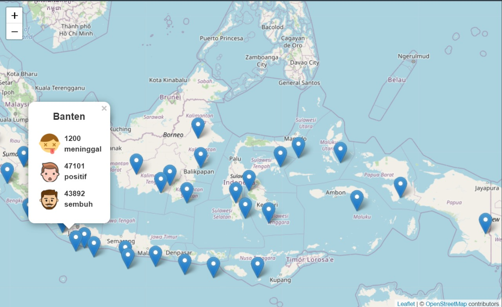
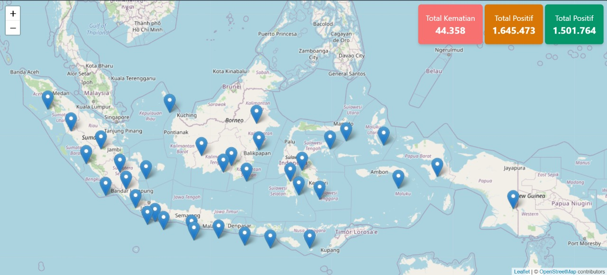

# **COVID-INFORMATION-WEB V1**

yups website ini adalah hasil explorasi dan kolaborasi dadakan dari **SIMPANSE DEV**

yang dibuat dengan tujuan memudahkan user dalam memantau perkembangan Covid-19 di Indonesia. 

Dalam pembuatannya kita menggunakan [Python](https://www.python.org/), dan [Flask](https://flask.palletsprojects.com/en/2.0.x/) untuk BE dan [Tailwind](https://tailwindcss.com/) untuk FE, serta menggunakan API dari [sini](https://services5.arcgis.com/VS6HdKS0VfIhv8Ct/arcgis/rest/services/COVID19_Indonesia_per_Provinsi/FeatureServer/0/query?where=1%3D1&outFields=*&outSR=4326&f=json)

---
## **Interface**

## **CONTRIBUTORS**
* [Makaveeli](https://github.com/makaveeli) :computer:
* [UbayDillah182](https://github.com/ubay1) :computer:
* [ariprusli](https://github.com/ariprusli) :art:

